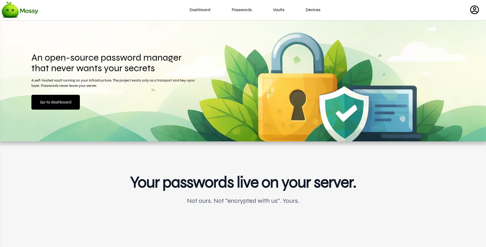
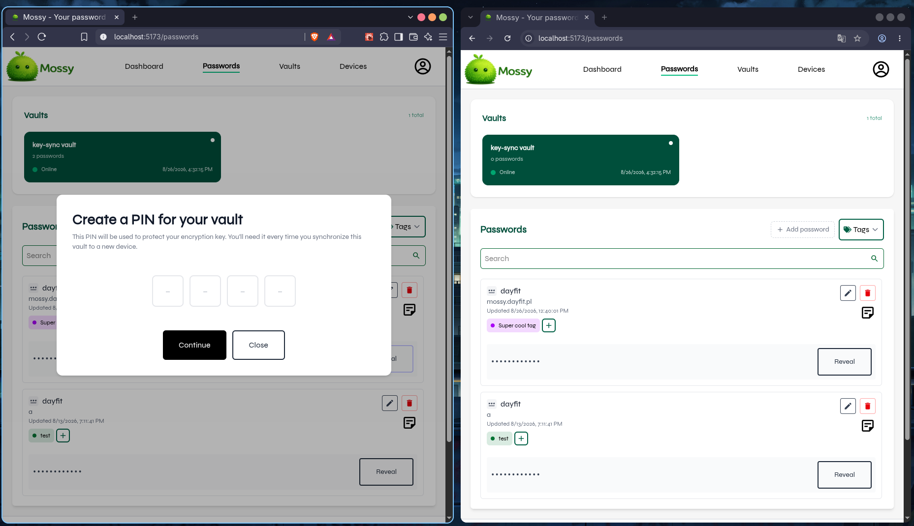
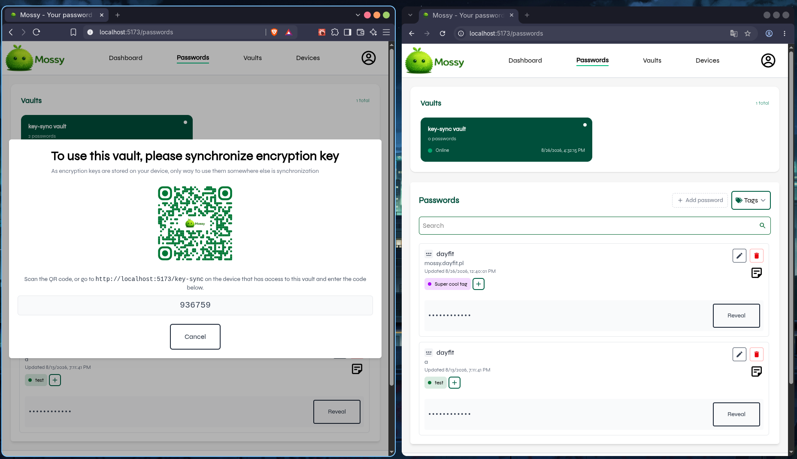
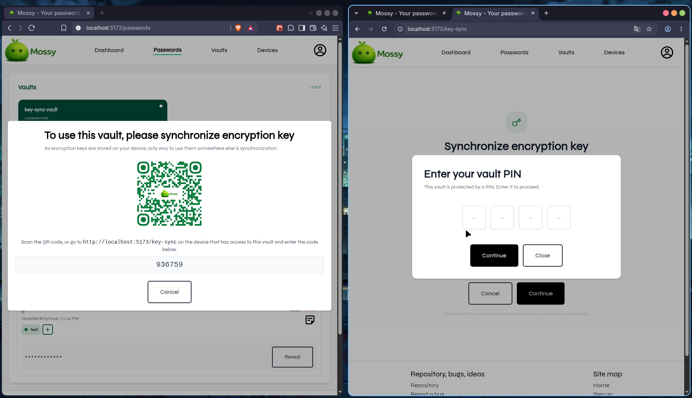
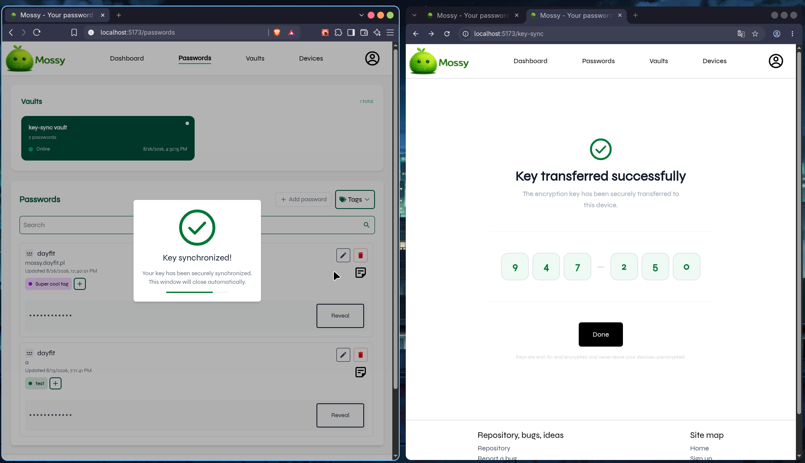

# Mossy

### Self-hosted password manager with a remotely accessible, end-to-end encrypted vault.


[](https://github.com/Day-fit/Mossy/actions/workflows/build-docker.yml)
[](https://deepwiki.com/Day-fit/Mossy)




## FAQ

- [Why Mossy?](#why-mossy)
- [Features](#features)
- [Architecture](#architecture)
- [Key security properties](#key-security-properties)
- [Device trust](#device-trust)
- [Key synchronization](#key-synchronization)
- [Key synchronization under the hood](#key-sync-under-the-hood)
- [Threat model](#threat-model)
- [Tech stack](#tech-stack)
- [Running locally](#running-locally)
- [Tests](#tests)
- [Limitations](#limitations)

## Why Mossy?

Mossy is designed so you can avoid typical self-hosting pain while keeping the majority of the benefits. You no longer need to worry about putting infrastructure on a VLAN, forwarding ports securely, or configuring a VPN. The vault makes an outbound STOMP-over-WebSocket connection to Mossy's relay, so you don't need to worry about this mess. Also, thanks to E2EE, your secret data remains encrypted even if your vault or the relay is compromised. \*

\* This assumes that your device, browser, and the frontend code delivered to it are not compromised, and that your vault key remains secret.

## Features

- Passwords can be accessed remotely via a backend relay over STOMP/WebSockets
- You can control which devices are blocked or allowed (an already-issued access token may remain valid for up to 15 minutes, the default token lifetime)
- A device enrollment system is provided (a device needs to be explicitly allowed to use an account)
- Cross-device key sync is accessible via the backend
- Basic SSH key support
- Password and SSH-key secret fields, as well as notes, are E2EE
- Passwords are stored locally in your vault
- There is a tag and search system
- You can add encrypted notes to passwords as well

## Architecture

Mossy is built using a hybrid architecture. It uses a backend relay (hosted by us) that makes accessing passwords from any location possible. The self-hosted vault connects to the relay via STOMP over WebSockets; thanks to that, you don't have to worry about a firewall or opening ports on your router.

### Backend

Mossy's backend is built using a microservice architecture. Thanks to that, if something goes wrong with statistics-related code, password access is still possible. [Precise breakdown](https://deepwiki.com/Day-fit/Mossy)

Authentication, token claims, JWKS rotation, and resource-server configuration are described in the [authentication guide](docs/authentication.md).

### Browser extension

Provides suggestions for filling in passwords and captures passwords.

### Vault

The vault is the place where your passwords are stored. It has its own database containing entry metadata (such as identifiers, addresses, and tags) and encrypted secret blobs, but it cannot see your vault keys, as they remain on your devices.

## Key security properties

- When syncing your vault key to another device, Mossy uses **X25519** with an
  ephemeral key pair generated for each synchronization session. Compromising a
  long-lived device identity key later does not reveal keys transferred in earlier
  sessions (forward secrecy), provided the ephemeral private keys have been discarded.
- Password and SSH-key secret payloads, as well as notes, are encrypted with
  **AES-256-GCM**.
  The key never leaves your device in plaintext.

## Device trust

Device Trust is the source of truth for devices. Every login to Mossy relies on whether Device Trust's proof-of-possession challenge is passed. This microservice also provides a way to fetch a given device's public identity key, which is used during key synchronization.

## Key synchronization

The key synchronization process looks like this:

1. A new device interacts with a vault whose key is not yet stored on that device (e.g., it tries to add a new password or reveal an existing one).
2. A dialog asking you to create a PIN for this vault will appear.
   
3. After providing the PIN, a code for syncing the key will be displayed.
   
4. On the device that already has the key (from now on referred to as the **sender**), go to the URL displayed in the dialog. In my case, it is `https://localhost:5173/key-sync`; on the production website, it will be `https://mossy.dayfit.pl/key-sync`.
5. The sender enters the key sync code.
   
6. The sender unlocks the vault using their PIN.
7. Done.
    

### Key-sync under the hood

1. The receiver calls:

 ```jsonc
{
	// POST /api/v1/key-sync/init
	"vaultId": "..."
}
 ```
This initializes a 15-minute room used for key synchronization.
2. Each device generates an ephemeral X25519 key pair for the synchronization session. Only the public key is sent through the server.
3. Each client constructs the following authentication transcript:

 ```
 mossy-key-sync-auth-v1
  + role
  + sync code
  + device ID
  + ephemeral X25519 public key
 ```

Each client signs the transcript using the device's long-lived Ed25519 private identity key. This binds the ephemeral key to:

- A particular registered device
- A particular sync code
- A particular role
- This protocol version

4. Both clients authenticate their WebSocket connections. The first WebSocket frame contains:

```json
  {
    "type": "AUTH_FRAME",
    "accessToken": "...",
    "signature": "...",
    "jwkPublicDh": {
      "kty": "OKP",
      "crv": "X25519",
      "x": "..."
    }
  }
```
The server validates the JWT, while the Ed25519 signature is validated on the frontend by the client.
5. Peers receive `PEER_DETAILS` containing the following information:
```
  - Device ID
  - Ephemeral public key
  - Signature
  - Vault ID
```
6. Each device fetches the other device's public identity key (Ed25519).
7. Both devices validate the peer's signature. If validation succeeds, they send:
```json
  {
    "type": "SIGNATURE_STATUS",
    "signatureAccepted": true
  }
```
The server waits for both peers to accept each other's signatures.
8. The peers calculate a shared secret, and the sender encrypts and signs the vault key before sending it through the backend.

## Threat model

Mossy encrypts secret fields and notes in the browser with AES-256-GCM before they leave your device. Cross-device vault-key synchronization uses an authenticated X25519 key exchange.

- What the backend (our servers) can see: session tokens, account and vault metadata, ciphertext, and public key-sync data
- What the backend cannot see: plaintext password or SSH-key secrets, plaintext notes, or unwrapped vault keys

## Tech stack

- Frontend
    - Node 22
    - React
    - Zustand
    - libsodium
    - Other smaller libraries
- Backend
    - Kotlin
    - Maven
    - Spring Boot 4: Foundation for the whole backend
    - Spring Web MVC: For creating the REST API
    - Spring Data JPA: Relational persistence
    - Spring Security: Authentication and authorization starter
    - Spring OAuth2 Resource Server: Protecting API with JWT
    - Spring Validation: DTO validation
    - Spring WebSocket: Provides a way to add WebSocket communication, the foundation for the key synchronization system
    - Spring Actuator: Health checks and metrics
- DevOps
    - Docker: Containerization tool
    - Docker Compose: For deployment
    - Redis: Cache layer and database for short-lived data
    - Kafka: Powers dashboard statistics
    - RabbitMQ: Coordinates requests between password-service replicas
    - PostgreSQL: Database system for the whole backend
    - Traefik: Routes requests to containers (reverse proxy and rate limiting as well)
    - GitHub Actions: CI/CD pipeline (testing and building Docker images)

## Running locally

Mossy is containerized, so you do not need to install Java, Maven, Node.js, PostgreSQL,
Redis, RabbitMQ, or Kafka on the host.

### Prerequisites

- [Git](https://git-scm.com/downloads) for cloning the repository.
- [Docker Desktop](https://docs.docker.com/desktop/) on Windows, macOS, or Linux. It
  includes Docker Engine, the Docker CLI, and Docker Compose.
- On Linux, you can instead install Docker Engine and the
  [Docker Compose plugin](https://docs.docker.com/compose/install/linux/).

Verify the installation before continuing:

```bash
docker --version
docker compose version
```

### Run only the vault (probably what you are looking for)

Use this option when you want to self-host only your encrypted vault while using the
public Mossy frontend and relay infrastructure. It starts two containers: the vault and
its PostgreSQL database.

1. Create a vault from the [Mossy vaults page](https://mossy.dayfit.pl/vaults). Copy the
   generated vault ID and secret immediately; the secret is displayed only once.
2. Clone the repository and enter the self-hosted directory:

   ```bash
   git clone https://github.com/Day-fit/Mossy.git
   cd Mossy/self-hosted
   ```

3. Create your local environment file:

   ```bash
   cp .env.example .env
   ```

4. Fill in `.env` with a PostgreSQL username and a strong password, followed by the
   vault ID and secret from step 1:

   ```dotenv
   DB_USER=mossy
   DB_PASSWORD=replace-with-a-strong-password

   MOSSY_VAULT_ID=replace-with-your-vault-id
   MOSSY_VAULT_SECRET=replace-with-your-vault-secret
   ```

5. Pull and start the containers:

   ```bash
   docker compose --profile prod pull
   docker compose --profile prod up -d
   ```

6. Confirm that both containers are healthy, then refresh the Mossy vaults page:

   ```bash
   docker compose --profile prod ps
   docker compose --profile prod logs -f mossy-vault
   ```

To stop the vault without deleting its database, run:

```bash
docker compose --profile prod down
```

### Run the whole infrastructure

> [!WARNING]
> This option creates a production-like local environment. It starts the frontend, all
> Mossy backend services, Traefik, PostgreSQL, Redis, RabbitMQ, and Kafka
> from the images defined in the root `compose.yaml`.

1. Clone the repository and enter its root directory:

   ```bash
   git clone https://github.com/Day-fit/Mossy.git
   cd Mossy
   ```

2. Create a root `.env` file containing the credentials and settings referenced by
   `compose.yaml`:

```dotenv
DB_NAME=mossy
DB_USER=mossy
DB_PASSWORD=replace-with-a-strong-password

REDIS_USER=mossy
REDIS_PASSWORD=replace-with-a-strong-password

RABBITMQ_USER=replace-with-the-configured-rabbitmq-user
RABBITMQ_PASSWORD=replace-with-the-configured-rabbitmq-password

ALLOWED_ORIGINS=https://mossy.dayfit.pl
```

The RabbitMQ credentials must match the user provisioned in
`rabbitmq/definitions.json`.

3. The included Traefik routes use `mossy.dayfit.pl`. For local browser access, map
   `mossy.dayfit.pl` to `127.0.0.1` in your system's hosts file. Because the local
   Traefik instance cannot obtain the production TLS certificate, your browser may show
   a certificate warning. Remove the hosts-file entry when you finish testing.

4. Pull and start the complete stack:

   ```bash
   docker compose --profile prod pull
   docker compose --profile prod up -d
   ```

5. Check container health and follow logs when diagnosing startup problems:

   ```bash
   docker compose --profile prod ps
   docker compose --profile prod logs -f
   ```

Once the services are healthy, open [https://mossy.dayfit.pl](https://mossy.dayfit.pl).

Stop the stack while preserving its named volumes with:

```bash
docker compose --profile prod down
```

> [!WARNING]
> `docker compose --profile prod down --volumes` also deletes the local databases and
> other persisted state.

## Tests

Run the backend test suite from the project root:

```bash
mvn test
```

Run the frontend tests:

```bash
cd mossy-frontend
npm install
npm test
```

## Limitations

- Currently, there is no way to access passwords without the backend relay. I'm planning to add an offline mode for users who prefer managing infrastructure on their own (no authentication system, just simple password storage).
